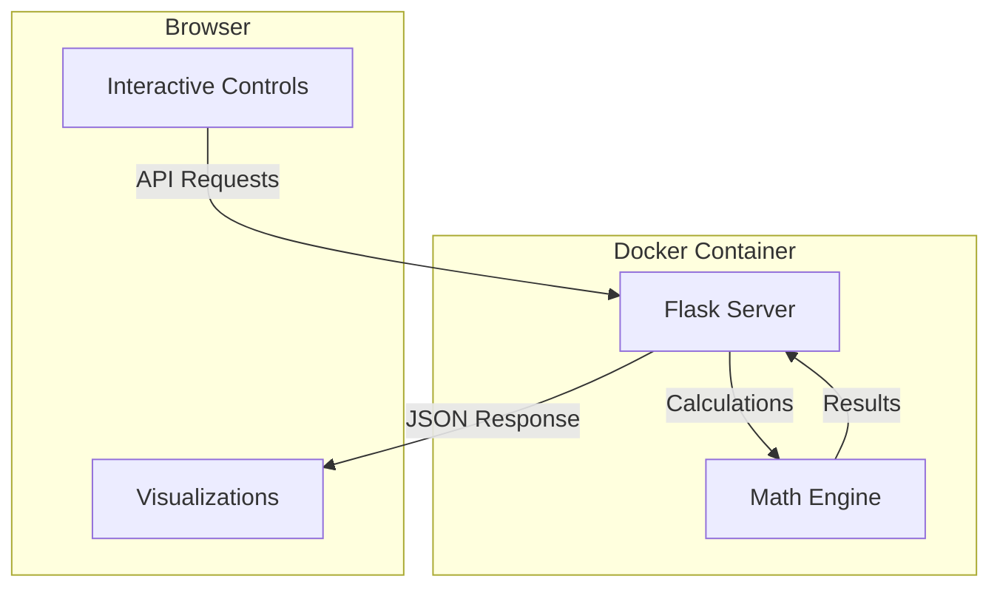

# Fairness Metrics Visualizer - Implementation Plan

An interactive web application to help users understand the relationship between fairness metrics (PPV, NPV, FPR, FNR) and the Impossibility Theorem of Fairness through hands-on visualization.

## Mathematical Foundation

### The Model
We simulate a binary classification scenario with **two populations** (A and B). For each population:

- **Truly Positive individuals**: risk scores follow `N(μ_pos, σ_pos)`
- **Truly Negative individuals**: risk scores follow `N(μ_neg, σ_neg)`
- **Base rate (prevalence)**: proportion `π` of the population that is truly positive
- **Threshold `T`**: scores above T are classified as positive

### Metrics Computed

| Metric | Formula | Meaning |
|--------|---------|---------|
| **TPR** (Sensitivity) | P(score > T \| truly positive) | Correctly identified positives |
| **FPR** | P(score > T \| truly negative) | False alarms |
| **TNR** (Specificity) | P(score ≤ T \| truly negative) | Correctly identified negatives |
| **FNR** | P(score ≤ T \| truly positive) | Missed positives |
| **PPV** | TPR×π / (TPR×π + FPR×(1-π)) | Precision of positive predictions |
| **NPV** | TNR×(1-π) / (TNR×(1-π) + FNR×π) | Precision of negative predictions |

### Impossibility Theorem
When prevalence differs between populations (π_A ≠ π_B), a single threshold **cannot** simultaneously achieve:
1. **Calibration**: Equal PPV across groups
2. **Error Rate Balance**: Equal FPR AND equal FNR across groups

The visualization will demonstrate this by showing how adjusting the threshold to equalize one metric necessarily causes others to diverge.

---

## Architecture Overview



---

## Proposed File Structure

```
FairnessMetrics/
├── app/
│   ├── __init__.py           # Flask app factory
│   ├── routes.py             # API endpoints
│   ├── math_engine.py        # Distribution & metrics calculations
│   ├── static/
│   │   ├── css/
│   │   │   └── style.css     # Main stylesheet
│   │   └── js/
│   │       ├── main.js       # App initialization & API calls
│   │       ├── controls.js   # Slider/input handling
│   │       └── visualizations/
│   │           ├── bellCurves.js      # Overlapping distributions
│   │           ├── confusionMatrix.js # Confusion matrix display
│   │           └── impossibility.js   # Theorem visualization
│   └── templates/
│       └── index.html        # Main page template
├── doc/
│   └── implementation_plan.md # This plan
├── tests/
│   └── test_math_engine.py   # Unit tests for math logic
├── .python-version           # Python version for UV
├── pyproject.toml            # Project config & dependencies (UV)
├── uv.lock                   # Lock file (auto-generated)
├── Dockerfile
├── docker-compose.yml
├── run.py                    # Entry point
└── README.md
```

---

## Proposed Changes

### Backend (Python/Flask)

#### [NEW] [pyproject.toml](file:///\\wsl.localhost\Ubuntu-20.04\home\tottern\Projects\FairnessMetrics\pyproject.toml)
Project configuration using UV package manager:
- Dependencies: Flask, NumPy, SciPy (for normal distribution CDF/PDF)
- Dev dependencies: pytest for testing
- Python version: 3.11+

#### [NEW] [math_engine.py](file:///\\wsl.localhost\Ubuntu-20.04\home\tottern\Projects\FairnessMetrics\app\math_engine.py)
Core calculation functions:
- `compute_rates(mu_pos, sigma_pos, mu_neg, sigma_neg, threshold)` → TPR, FPR, TNR, FNR
- `compute_predictive_values(tpr, fpr, tnr, fnr, prevalence)` → PPV, NPV
- `generate_distribution_points(mu, sigma, x_range)` → Points for plotting bell curves
- `compute_confusion_matrix(rates, prevalence, population_size)` → TP, FP, TN, FN counts

#### [NEW] [routes.py](file:///\\wsl.localhost\Ubuntu-20.04\home\tottern\Projects\FairnessMetrics\app\routes.py)
API Endpoints:
- `GET /api/calculate` - Takes all parameters, returns complete metrics for both populations
- `GET /api/distribution-points` - Returns x,y points for plotting distributions

---

### Frontend (JavaScript/HTML/CSS)

#### [NEW] [index.html](file:///\\wsl.localhost\Ubuntu-20.04\home\tottern\Projects\FairnessMetrics\app\templates\index.html)
Layout structure:
```
┌─────────────────────────────────────────────────────────────────┐
│                        Header / Title                            │
├───────────────────┬─────────────────────────────────────────────┤
│                   │                                              │
│   Control Panel   │         Bell Curve Visualization            │
│   - Threshold     │    (Population A and B overlaid)            │
│   - Pop A params  │                                              │
│   - Pop B params  │─────────────────────────────────────────────│
│                   │                                              │
│                   │  ┌─────────────┐    ┌─────────────┐         │
│                   │  │ Confusion   │    │ Confusion   │         │
│                   │  │ Matrix A    │    │ Matrix B    │         │
│                   │  └─────────────┘    └─────────────┘         │
│                   │─────────────────────────────────────────────│
│                   │                                              │
│                   │       Impossibility Theorem Viz              │
│                   │   (Metric comparison bar charts)            │
│                   │                                              │
└───────────────────┴─────────────────────────────────────────────┘
```

#### [NEW] [bellCurves.js](file:///\\wsl.localhost\Ubuntu-20.04\home\tottern\Projects\FairnessMetrics\app\static\js\visualizations\bellCurves.js)
- Uses HTML5 Canvas for rendering
- Draws 4 curves: Pop A positive, Pop A negative, Pop B positive, Pop B negative
- Color-coded by population (e.g., blues for A, oranges for B)
- Solid vs dashed for positive vs negative
- Vertical threshold line (draggable)
- Shaded regions showing TP, FP, TN, FN areas under curves

#### [NEW] [confusionMatrix.js](file:///\\wsl.localhost\Ubuntu-20.04\home\tottern\Projects\FairnessMetrics\app\static\js\visualizations\confusionMatrix.js)
- Two side-by-side matrices (Population A and B)
- Shows counts (TP, FP, TN, FN) and rates (TPR, FPR, etc.)
- Color intensity proportional to count

#### [NEW] [impossibility.js](file:///\\wsl.localhost\Ubuntu-20.04\home\tottern\Projects\FairnessMetrics\app\static\js\visualizations\impossibility.js)
- Side-by-side bar charts comparing PPV, NPV, FPR, FNR between populations
- Visual indicators showing which metrics are "balanced" vs "imbalanced"
- Highlight the tradeoff: as one metric pair equalizes, others diverge

---

### Docker Configuration

#### [NEW] [Dockerfile](file:///\\wsl.localhost\Ubuntu-20.04\home\tottern\Projects\FairnessMetrics\Dockerfile)
```dockerfile
FROM python:3.11-slim

# Install UV
COPY --from=ghcr.io/astral-sh/uv:latest /uv /uvx /bin/

WORKDIR /app

# Copy dependency files first for layer caching
COPY pyproject.toml uv.lock ./

# Install dependencies (frozen from lock file)
RUN uv sync --frozen --no-dev

# Copy application code
COPY . .

EXPOSE 5000
CMD ["uv", "run", "python", "run.py"]
```

#### [NEW] [docker-compose.yml](file:///\\wsl.localhost\Ubuntu-20.04\home\tottern\Projects\FairnessMetrics\docker-compose.yml)
Simple service definition with port mapping (5000:5000)

---

## User Controls (Sliders/Inputs)

| Control | Range | Default | Description |
|---------|-------|---------|-------------|
| **Threshold** | 0-100 | 50 | Classification cutoff |
| **Pop A: μ (positive)** | 0-100 | 65 | Mean score for truly positive in A |
| **Pop A: σ (positive)** | 1-30 | 15 | Spread of positive scores in A |
| **Pop A: μ (negative)** | 0-100 | 35 | Mean score for truly negative in A |
| **Pop A: σ (negative)** | 1-30 | 15 | Spread of negative scores in A |
| **Pop A: Prevalence** | 0.01-0.99 | 0.30 | Base rate in A |
| **Pop B: μ (positive)** | 0-100 | 65 | Mean score for truly positive in B |
| **Pop B: σ (positive)** | 1-30 | 15 | Spread of positive scores in B |
| **Pop B: μ (negative)** | 0-100 | 35 | Mean score for truly negative in B |
| **Pop B: σ (negative)** | 1-30 | 15 | Spread of negative scores in B |
| **Pop B: Prevalence** | 0.01-0.99 | 0.50 | Base rate in B |

> [!TIP]
> The default values are set so that the distributions are identical between populations, but prevalence differs. This immediately demonstrates the impossibility theorem.

---

## Design Aesthetic

- **Color Palette**: Dark mode with high contrast
  - Background: `#1a1a2e` (deep navy)
  - Pop A colors: Blues (`#4361ee`, `#7209b7`)
  - Pop B colors: Oranges (`#f72585`, `#ff6b35`)
  - Text: `#e0e0e0`
- **Typography**: Inter or Roboto for clean readability
- **Animations**: Smooth transitions on slider changes (CSS transitions + requestAnimationFrame)
- **Cards**: Glassmorphism for visualization containers

---

## Verification Plan

### Automated Tests
- Unit tests for `math_engine.py` verifying:
  - TPR + FNR = 1
  - TNR + FPR = 1
  - PPV/NPV formulas match expected values for known inputs
  - Edge cases (prevalence = 0 or 1, threshold at extremes)

### Manual Verification
- Run in Docker and verify:
  - All sliders respond and update visualizations live
  - Bell curves render correctly with proper coloring
  - Confusion matrices update with reasonable counts
  - Impossibility theorem visualization shows divergence when prevalence differs
  - Dragging threshold updates all displays simultaneously

### Browser Testing
- Test in Chrome to verify Canvas rendering and interactivity
